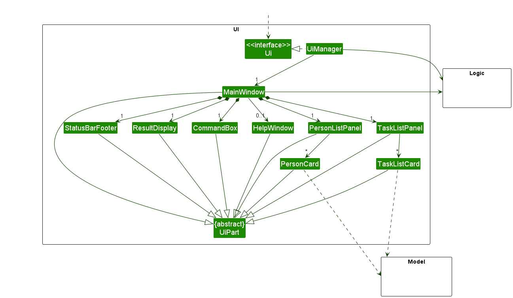
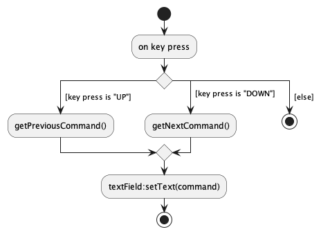
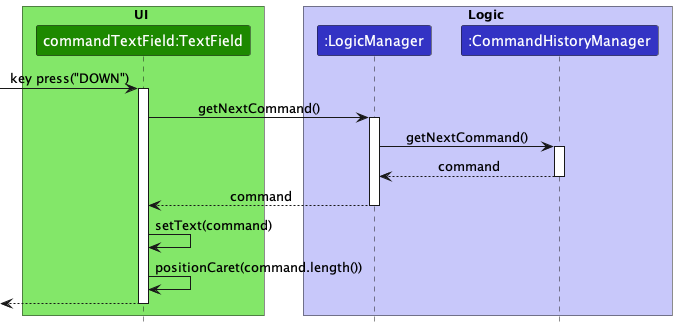
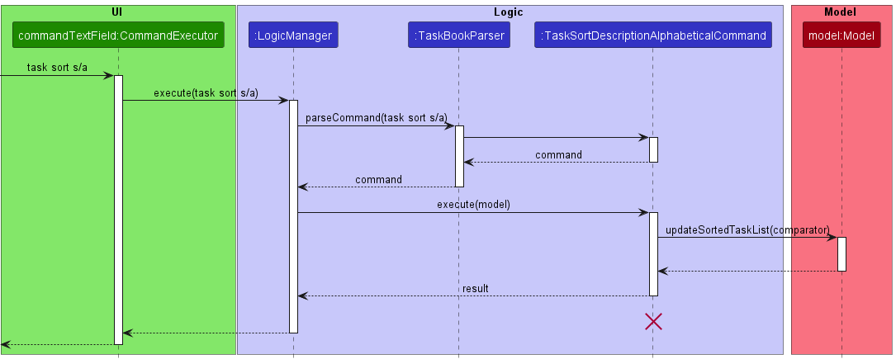
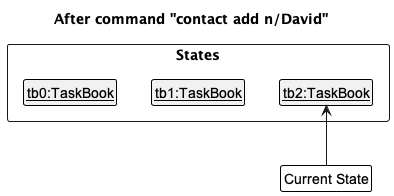
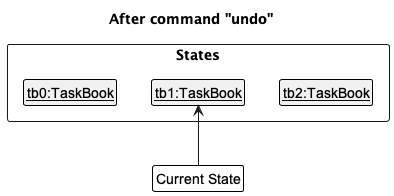
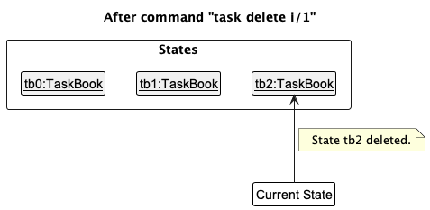
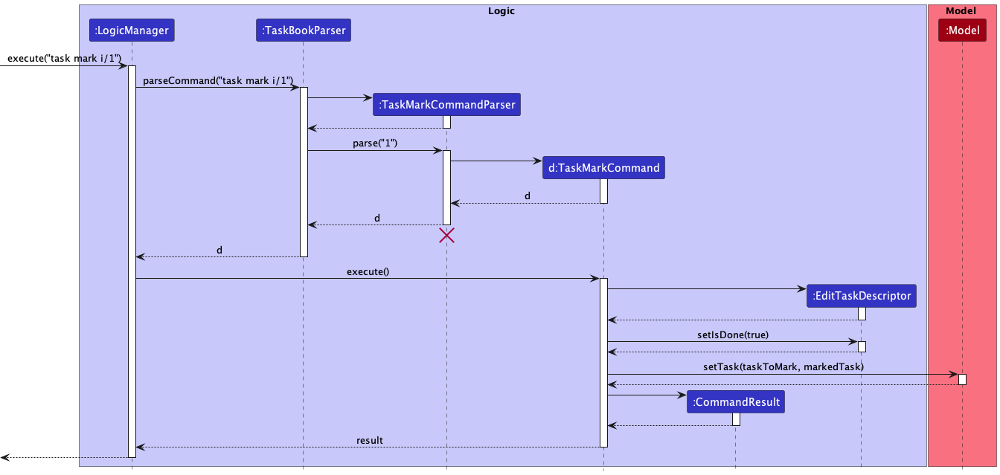
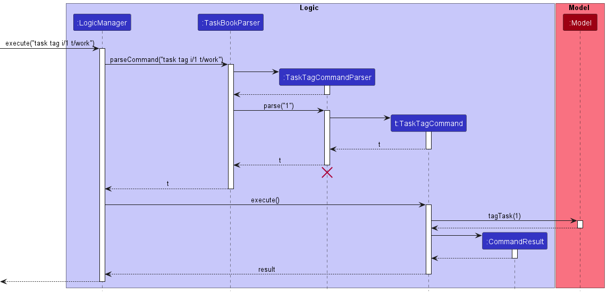

## Welcome to TaskBook!

TaskBook is a **desktop app for managing contacts and tasks, optimized for use via a Command Line Interface** (CLI) while still having the benefits of a Graphical User Interface (GUI). If you can type fast, TaskBook can get your contact and task management tasks done faster than traditional GUI apps.

This developer's guide consists of the following sections. Note that TaskBook is developed with Java 11.
* Table of Contents
{:toc}

--------------------------------------------------------------------------------------------------------------------

## **Acknowledgements**

* This project is based on the AddressBook-Level3 (AB-3) project created by the [SE-EDU initiative](https://se-education.org).
* The use of SortedList in ModelManager was inspired by [Harmonia](https://github.com/AY2122S2-CS2103T-T09-1/tp), a project also based on AddressBook-Level3.
* The saving and storing of TaskBook in StorageManager was adapted from AddressBook-Level3 to include support for Tasks.
* Third party libraries used: [JavaFX](https://openjfx.io/), [Jackson](https://github.com/FasterXML/jackson), [JUnit5](https://github.com/junit-team/junit5).

--------------------------------------------------------------------------------------------------------------------

## **Setting up, getting started**

Refer to the guide [_Setting up and getting started_](SettingUp.md).

--------------------------------------------------------------------------------------------------------------------

## **Design**

:bulb: **Tip:** The `.puml` files used to create diagrams in this document can be found in the [diagrams](https://github.com/AY2223S1-CS2103T-T13-4/tp/tree/master/docs/diagrams/) folder. Refer to the [_PlantUML Tutorial_ at se-edu/guides](https://se-education.org/guides/tutorials/plantUml.html) to learn how to create and edit diagrams.

### Architecture

The ***Architecture Diagram*** given above explains the high-level design of TaskBook.

Given below is a quick overview of main components and how they interact with each other.

**Main components of the architecture**

**`Main`** has two classes called [`Main`](https://github.com/AY2223S1-CS2103T-T13-4/tp/tree/master/src/main/java/taskbook/Main.java) and [`MainApp`](https://github.com/AY2223S1-CS2103T-T13-4/tp/tree/master/src/main/java/taskbook/MainApp.java). It is responsible for,
* At app launch: Initializes the components in the correct sequence, and connects them up with each other.
* At shut down: Shuts down the components and invokes cleanup methods where necessary.

[**`Commons`**](#common-classes) represents a collection of classes used by multiple other components.

The rest of the App consists of four components.

* [**`UI`**](#ui-component): The UI of the App.
* [**`Logic`**](#logic-component): The command executor.
* [**`Model`**](#model-component): Holds the data of the App in memory.
* [**`Storage`**](#storage-component): Reads data from, and writes data in JSON format to local storage.

**How the architecture components interact with each other**

The *Sequence Diagram* below shows how the components interact with each other for the scenario where the user issues the command `task delete i/1`.

Each of the four main components (also shown in the diagram above),

* defines its *API* in an `interface` with the same name as the Component.
* implements its functionality using a concrete `{Component Name}Manager` class (which follows the corresponding API `interface` mentioned in the previous point.

For example, the `Logic` component defines its API in the `Logic.java` interface and implements its functionality using the `LogicManager.java` class which follows the `Logic` interface. Other components interact with a given component through its interface rather than the concrete class (reason: to prevent outside component's being coupled to the implementation of a component), as illustrated in the (partial) class diagram below.

The sections below give more details of each component.

### UI component

The **API** of this component is specified in [`Ui.java`](https://github.com/AY2223S1-CS2103T-T13-4/tp/tree/master/src/main/java/taskbook/ui/Ui.java)

The UI consists of a `MainWindow` that is made up of parts e.g.`CommandBox`, `ResultDisplay`, `PersonListPanel`, `StatusBarFooter` etc. All these, including the `MainWindow`, inherit from the abstract `UiPart` class which captures the commonalities between classes that represent parts of the visible GUI.

The `UI` component uses the JavaFx UI framework. The layout of these UI parts are defined in matching `.fxml` files that are in the `src/main/resources/view` folder. For example, the layout of the [`MainWindow`](https://github.com/AY2223S1-CS2103T-T13-4/tp/tree/master/src/main/java/taskbook/ui/MainWindow.java) is specified in [`MainWindow.fxml`](https://github.com/AY2223S1-CS2103T-T13-4/tp/tree/master/src/main/resources/view/MainWindow.fxml)

The `UI` component,

* executes user commands using the `Logic` component.
* listens for changes to `Model` data so that the UI can be updated with the modified data.
* keeps a reference to the `Logic` component, because the `UI` relies on the `Logic` to execute commands.
* depends on some classes in the `Model` component, as it displays `Person` object residing in the `Model`.

### Logic component

**API** : [`Logic.java`](https://github.com/AY2223S1-CS2103T-T13-4/tp/tree/master/src/main/java/taskbook/logic/Logic.java)

Here's a (partial) class diagram of the `Logic` component:

How the `Logic` component works:
1. When `Logic` is called upon to execute a command, it uses the `TaskBookParser` class to parse the user command.
1. This results in a `Command` object (more precisely, an object of one of its subclasses e.g., `AddCommand`) which is executed by the `LogicManager`.
1. The command can communicate with the `Model` when it is executed (e.g. to add a person).
1. The result of the command execution is encapsulated as a `CommandResult` object which is returned from `Logic`.

The Sequence Diagram below illustrates the interactions within the `Logic` component for the `execute("delete 1")` API call.

:information_source: **Note:** The lifeline for `ContactDeleteCommandParser` should end at the destroy marker (X) but due to a limitation of PlantUML, the lifeline reaches the end of diagram.

Here are the other classes in `Logic` (omitted from the class diagram above) that are used for parsing a user command:

How the parsing works:
* When called upon to parse a user command, the `TaskBookParser` class detects the category that the command belongs to and calls upon the appropriate Category Parser (`ContactCategoryParser`, `TaskCategoryParser`, `CategorylessParser`).
* The Category Parser creates an `XYZCommandParser` (`XYZ` is a placeholder for the specific command name e.g., `ContactAddCommandParser`) which uses the other classes shown above to parse the user command and create a `XYZCommand` object (e.g., `ContactAddCommand`) which results in the `TaskBookParser` returning a `Command` object.
* All `XYZCommandParser` classes (e.g., `ContactAddCommandParser`, `ContactDeleteCommandParser`, ...) inherit from the `Parser` interface so that they can be treated similarly where possible e.g, during testing.

### Model component
**API** : [`Model.java`](https://github.com/AY2223S1-CS2103T-T13-4/tp/tree/master/src/main/java/taskbook/model/Model.java)

The `Model` component,

* stores the task book data i.e., all `Person` objects which are contained in a `UniquePersonList` object, as well as `Task` objects which are contained in a `TaskList` a object.
* stores a subset of `Person` objects in the `UniquePersonList` (according to user filter query) as a separate _filtered_ list which is exposed to outsiders as an unmodifiable `ObservableList<Person>` that can be 'observed' e.g. the UI can be bound to this list so that the UI automatically updates when the data in the list change.
* stores a subset of `Task` objects in the `TaskList` (according to user filter query) as a separate _filtered_ list which is exposed to outsiders as an unmodifiable `ObservableList<Task>` that can be 'observed'.
* stores the `Task` objects in the _filtered_ list above (according to user sort query) as a _sorted_ list which is exposed to outsiders as an unmodifiable `ObservableList<Task>` that can be 'observed'.
* stores a `UserPref` object that represents the user’s preferences. This is exposed to the outside as a `ReadOnlyUserPref` objects.
* does not depend on any of the other three components (as the `Model` represents data entities of the domain, they should make sense on their own without depending on other components)

### Storage component

**API** : [`Storage.java`](https://github.com/AY2223S1-CS2103T-T13-4/tp/tree/master/src/main/java/taskbook/storage/Storage.java)

The `Storage` component,
* saves contacts and tasks in JSON format to local storage, and reads them back into corresponding objects.
* saves user preferences in JSON format to local storage, and reads them back into corresponding objects.
* inherits from both `TaskBookStorage` and `UserPrefStorage`, which means it can be treated as either (if only the functionality of only one is needed).
* depends on corresponding classes in the `Model` component for serialization (converting objects to JSON format) and deserialization (recreating objects from JSON format).

### Common classes

Classes commonly used by multiple components are in the `taskbook.commons` package. This promotes reusable code that must be maintained with care as there may be multiple dependencies.

--------------------------------------------------------------------------------------------------------------------

## **Implementation**

This section describes details on how certain noteworthy features are implemented.

### Command History Navigation

#### Implementation

The command history navigation mechanism is facilitated by `CommandHistoryManager`, which is a concrete implementation of `CommandHistory`, that internally stores the current state with `commandsList` and `pointer`. Additionally, it implements the following operations:

* `CommandHistory#getPreviousCommmand()` — Retrieves the previous command from its history.
* `CommandHistory#getNextCommmand()` — Retrieves the next command from its history.
* `CommandHistory#addCommand(String command)` — Adds a new command into its history.

The methods successfully handles edge cases where the command history is empty, full and when there are no more previous or next commands to navigate to.

`CommandHistoryManager` can be instantiated with an optional capacity, the default is as explained in the design considerations below. When the size of the command history exceeds double the allocated capacity, the older half of the history is pruned.

`LogicManager` will store an instance of `CommandHistoryManager`, which is used as follows:

* To detect key presses for `UP` and `DOWN` arrow keys, set the `setOnKeyPressed` for the `commandTextField` on start up, which calls `CommandHistory#getPreviousCommmand()` and `CommandHistory#getNextCommmand()` respectively and updates the text displayed.
* When handling user input, call `CommandHistory#addCommand(commandText)` with the `commandText` in `CommandBox#handleCommandEntered()` to save the user’s input into the command history. Even if the commands are invalid, save them into the history. This allows the user to fix the wrong commands and re-execute them.

Note: Some intermediate steps are omitted for simplicity. Full details are in the sequence diagram below.

Given below is an example of a usage scenario and how the command history mechanism behaves at each step.

Step 1. The user launches the application. `CommandHistoryManager` will be initialized in `CommandBox`. The internal `commandsHistoryList` will be empty and the `commandsHistoryPointer` will point to the `0`th element, which represents the absence of a command. Attempting to retrieve this `0`th element would return an empty string instead.

Step 2. The user executes a few commands. Regardless whether these commands are valid or invalid, each of these inputs fires `CommandHistory#addCommand` once with their respective command texts.

Step 3. The user navigates to a previous command by clicking the `UP` arrow key. `CommandHistory#getPreviousCommmand()` will be called.

Step 4. The user navigates to a next command by clicking the `DOWN` arrow key. `CommandHistory#getNextCommmand()` will be called.

The following sequence diagram shows how the next command history navigation works, if there is a next command to navigate to:

#### Design considerations

**Aspect: Saving invalid commands:**

* **Alternative 1 (chosen choice):** Invalid commands are saved in the command history.
    * Pros: Allows the user to navigate to an invalid command and rectify before re-executing it, so that the user does not have to retype the entire command.
    * Cons: Clutters the command history.

* **Alternative 2:** Invalid commands are not saved in the command history, only valid commands are saved.
    * Pros: Uses less memory, command history is not cluttered with incorrect commands.
    * Cons: Does not allow the user to access and rectify a previous incorrect command.

**Aspect: Saving empty commands:**

* **Current choice:** Empty commands are not saved in the command history.
    * Rationale: To not clutter the command history.

**Aspect: How many commands to be supported:**

* **Current choice:** 1000 commands.
    * Rationale: To keep memory usage low, minimise the number of commands saved in the history. 1000 commands is a reasonably large enough number of commands to store and is sufficient even for advanced users.

### Sorting Task List

#### Sorting Implementation

This section details how the sorting of tasks is implemented. The sorting of contacts is a slightly simplified version.

The sorting of tasks is facilitated by `ModelManager`. It implements `Model`, and contains a `filteredTasks` list which is the `TaskList` of TaskBook in a `FilteredList` 'wrapper' from `javafc.collections.transformation`.

A second field, `sortedTasks`, then stores `filteredTasks` wrapped in a `SortedList` from `javafx.collections.transformation`. Commands executed on `filteredTasks` will also be reflected in `sortedTasks` as the latter is the former in a `SortedList` wrapper.

`SortedList` implements the method `SortedList#setComparator(Comparator<? super E> comparator)` that takes in a comparator used to sort the tasks. The method `ModelManager#updateSortedTaskList(Comparator<Task> comparator)` is thus implemented to allow for setting of a comparator in `sortedTasks`.

When the sorting comparator is `null`, `sortedTasks` will be of the same order as `filteredTasks` in chronological order that the tasks were added in. By default, the sorting comparator is `null`.

The `Ui` displays the `sortedTasks` version of the task list by default on the right side panel.

#### Sorting Execution

When you enter `task sort s/SORT_TYPE`, the `Ui` sends the command to `Logic`. `Logic` then identifies the correct type `TaskSortCommand` that you entered, and creates an instance of it. Each `TaskSortCommand` contains a `comparator` to set in `sortedTasks` in the `Model`. `Logic` finally executes the command, which then correctly sets the comparator in `sortedTasks` in `Model`.

There is one sort command specifically for you to set the comparator to null. Do not directly set the comparator to null in other ways.

#### Example Usage

Given below is an example of a usage scenario and how the sorting mechanism behaves at each step.

Step 1: The user launches the application, which already contains a task list from previous usage. `sortedList` will be initialized in `ModelManager`. The initial `comparator` in `sortedList` will be null, so the tasks are sorted by the date and time they were added.

Step 2: The user executes `task sort s/a` command to sort the tasks descriptions in alphabetical order. The `TaskSortCommandParser` uses `s/a` to determine that the command is a `TaskSortDescriptionAlphabeticalCommand`. This command calls `Model#updateSortedTaskList(Comparator<Task> comparator)`, which sets the comparator in `sortedTasks` to one that compares the strings of tasks, and the `Ui` displays the new ordering of the tasks given by `sortedTasks`, where tasks are alphabetically ordered by their descriptions.

Step 3: The user executes `task sort s/ca` command to sort the tasks by when they were added in task book. The `TaskSortCommandParser` uses `s/ca` to determine that the command is a `TaskSortAddedChronologicalCommand`. This command calls `Model#resetSortedTaskList()`, which sets the comparator in `sortedTasks` to null, and the `Ui` displays the new ordering of the tasks given by `sortedTasks`, which will be the same ordering as the one that would be given by `filteredTasks`.

The following sequence diagram shows how a sort by description alphabetical command is executed:

#### Design considerations

**Aspect: Sorting command structure:**

* **Alternative 1 (current choice):** Have an abstract sort command from which all other sort commands must inherit from.
    * Pros: Follows Open-Closed Principle
    * Cons: More code required
* **Alternative 2:** Have only 1 sort command that has multiple methods, and the parser will choose which to execute.
    * Pros: Less code required
    * Cons: Violates Open-Closed Principle

**Aspect: Sorted List structure:**

* **Current choice:** Wrap the task list in a `FilteredList`, and the `FilteredList` in a `SortedList`.
    * Rationale: Commands on the filtered list will also be reflected in the sorted list. This means that the `Ui` can display `sortedTasks`, which reflects both filter and sorting order.

### Undo/redo feature

#### Implementation

The undo/redo mechanism is facilitated by `VersionedTaskBook`. It stores various `TaskBook` states with an undo/redo history, stored internally as an `taskBookStateList` and `pointer`. Additionally, it implements the following operations:

* `VersionedTaskBook#commit(TaskBook)` — Saves the current task book state in its history, if there are any changes in the state.
* `VersionedTaskBook#undo()` — Restores the previous task book state from its history.
* `VersionedTaskBook#redo()` — Restores a previously undone task book state from its history.

`VersionedTaskBook` can be instantiated with an optional capacity, the default is as explained in the design considerations below. When the size of the version history exceeds double the allocated capacity, the older half of the history is pruned.

These operations are exposed in the `Model` interface as `Model#commitTaskBook()`, `Model#undoTaskBook()` and `Model#redoTaskBook()` respectively.

Given below is an example of a usage scenario and how the undo/redo mechanism behaves at each step.

Step 1. The user launches the application. The `VersionedTaskBook` will be initialized with the initial task book state, and the `pointer` pointing to that single task book state.

Step 2. The user executes `contact delete i/5` command to delete the 5th person in the task book. The `contact delete i/5` command calls `Model#commitTaskBook()`, causing the modified state of the task book after the `contact delete i/5` command executes to be saved in the `taskBookStateList`, and the `pointer` is shifted to the newly inserted task book state.

Step 3. The user executes `contact add n/David …​` to add a new person. The `add` command also calls `Model#commitTaskBook()`, causing another modified task book state to be saved into the `taskBookStateList`.

:information_source: **Note:** If a command fails its execution, it will not call `Model#commitTaskBook()`, so the task book state will not be saved into the `taskBookStateList`.

Step 4. The user now decides that adding the person was a mistake, and decides to undo that action by executing the `undo` command. The `undo` command will call `Model#undoTaskBook()`, which will shift the `pointer` once to the left, pointing it to the previous task book state, and restores the task book to that state.

:information_source: **Note:** If the `pointer` is at index 0, pointing to the initial TaskBook state, then there are no previous TaskBook states to restore. The `undo` command uses `Model#canUndoTaskBook()` to check if this is the case. If so, it will return an error to the user rather
than attempting to perform the undo.

The following sequence diagram shows how the undo operation works:

:information_source: **Note:** The lifeline for `UndoCommand` should end at the destroy marker (X) but due to a limitation of PlantUML, the lifeline reaches the end of diagram.

The `redo` command does the opposite — it calls `Model#redoTaskBook()`, which shifts the `pointer` once to the right, pointing to the previously undone state, and restores the task book to that state.

:information_source: **Note:** If the `pointer` is at index `taskBookStateList.size() - 1`, pointing to the latest task book state, then there are no undone TaskBook states to restore. The `redo` command uses `Model#canRedoTaskBook()` to check if this is the case. If so, it will return an error to the user rather than attempting to perform the redo.

Step 5. The user then decides to execute the command `task sort s/a`. Commands that do not modify the task book, such as `task sort s/a`, will usually not call `Model#undoTaskBook()` or `Model#redoTaskBook()`. Thus, the `taskBookStateList` remains unchanged.

Step 6. The user executes `task delete i/1`, which calls `Model#commitTaskBook()`. Since the `pointer` is not pointing at the end of the `taskBookStateList`, all task book states after the `pointer` will be purged. Reason: It no longer makes sense to redo the `contact add n/David …​` command. This is the behavior that most modern desktop applications follow.

The following activity diagram summarizes what happens when a user executes a new command:

#### Design considerations

**Aspect: How undo & redo executes:**

* **Alternative 1 (current choice):** Saves the entire task book.
  * Pros: Easy to implement.
  * Cons: May have performance issues in terms of memory usage.

* **Alternative 2:** Individual command knows how to undo/redo by
  itself.
  * Pros: Will use less memory (e.g. for `delete`, just save the person being deleted).
  * Cons: We must ensure that the implementation of each individual command are correct.

**Aspect: How many undo operations to be supported:**

* **Current choice:** 15 commands.
  * Rationale: With the current choice of execution, would have to store `x` copies of the task book for `x` operations supported. Thus, the number of operations is kept low to ensure that memory usage remains low.

**Aspect: How many redo operations to be supported:**

* **Current choice:** 15 commands.
    * Rationale: Since the current choice of undo operations to be supported is 15, the number of redo operations supported is also 15.

**Aspect: Invalid undo/redo operation:**

* **Current choice:** Show an error to the user in the UI.
    * Rationale: Alert the user of the invalid action, stemming from a lack of actions to undo/redo, so that the user is aware that the command is invalid.

### Mark/Unmark Task Command

#### Implementation

The mark and unmark task command mechanism is facilitated by `TaskMarkCommand` and `TaskUnmarkCommand` which extend `Command`, `TaskMarkCommandParser`, `TaskUnmarkCommandParser` and `EditTaskDescriptor`. 

Additionally, it implements the following operations:

* `MarkTaskCommand#execute()` — Executes the chain of instructions to change the status of the task to done.
* `MarkTaskCommandParser#parse()` — Parses user input and creates a TaskMarkCommand object.
* `UnmarkTaskCommand#execute()` — Executes the chain of instructions to change the status of the task to undone.
* `UnmarkTaskCommandParser#parse()` — Parses user input and creates a TaskUnmarkCommand object.

The methods will handle cases where the index from the user input is out of bounds. 

Note: Some interim steps are omitted for simplicity. Full details are in the sequence diagram below.

Given below is an example of a usage scenario for how the task mark command mechanism behaves at each step.

Step 1. The user launches the application for the first time.

Step 2: The user adds a task.

Step 3. The user executes the task mark command on the first task.

The steps can be applied to task unmark command in the same way.

The following sequence diagram shows how the task mark command works:

The task unmark command follows a similar sequence diagram.

#### Design considerations

**Aspect: Mutability of boolean isDone field:**

* **Alternative 1 (current choice):** Immutable isDone field in Task object.
    * Pros: Reuse the same component from task edit command, reducing chance of breaking.
    * Cons: Extra overhead as a new task is created when the user marks it as done.

* **Alternative 2:** Mutable isDone field in the Task object.
    * Pros: Less overhead as it will only involve changing the isDone field in the object.
    * Cons: Mutable field may result in regression with other components such as Storage and UI.

### Tagging/Untagging tasks

#### Implementation

The tagging feature is implemented through integrating the `Tag` class into the `Task` classes, as well as their 
command classes and parser classes. 

The `Parser` classes are modified to resolve for tags through the `ArgumentTokenizer.tokenize()` and `ParserUtil.parseTags()` 
methods to obtain `Set<Tag>`.

Each of the task command classes (`TaskAddCommand`, `TaskDeleteCommand`, `TaskEditCommand` etc.) accept the parsed set 
of `Tag` objects when initialized.

The task classes (`Todo` etc.) are also created with the set of `Tag` objects.

To locally store information about the tags, the `Set<Tag>` object is passed into a `JSONAdaptedTask` and stored
as individual `JSONAdaptedTag` objects. To load the tags into the application, the `JSONAdaptedTag`s are iterated through
and recreated into objects in memory through the `toModelType()` method.

#### Alternative Implementation 

An alternative implementation to consider may be through the use of individual commands to tag/untag a task.

In such a case, the tag and untag task mechanism is facilitated by `TaskTagCommand`, which extends from `Command`.

It implements the following operations:

* `TaskTagCommand#execute()` — Executes and coordinates the necessary objects and methods to tag a task.
* `TaskTagCommandParser#parse()` — Parses user input from UI and initializes a TaskTagCommand object.

Cases such as where the index from the user input is out of bounds, are handled by the methods.

Given below is an example of a usage scenario for how the `TaskTagCommand` mechanism behaves at each step.

Step 1. The user launches the application for the first time. 

Step 2: The user adds a task.

Step 3. The user tags their task with the command `task tag i/1 t/work`. 

The following sequence diagram shows how the `TaskTagCommand` works:

#### Design considerations

**Aspect: Untagging tasks:**

* **Current choice:** Use the same command to untag a task but without the `t/` modifier, i.e. `task tag i/1`.
    * Rationale: Reduce unnecessary number of commands for both user and developer's mental health.

**Aspect: Saving empty tags:**

* **Current choice:** Empty tags are not saved.
    * Rationale: Does not unnecessarily clutter the number of tags saved to a task.
  
### ToDo/Deadline/Event Task types

#### Implementation

The Todo, Deadline and Event task types is facilitated by `TaskList`. It extends `Task` with 3 specific task types. Additional features of each task type:

- ToDo: Nil
- Event: Event Date
- Deadline: Deadline Date

#### Design Considerations:

**Aspect: `Task` superclass implementation**

* **Current choice:** Implement `Task` as an abstract class.
    * Rationale: Having the specific task types extend from `Task` allows `TaskList` to store them homogeneously. `Task` is made abstract as `ToDo` Task type models a basic task without a concept of time.

--------------------------------------------------------------------------------------------------------------------

## **Documentation, logging, testing, configuration, dev-ops**

* [Documentation guide](Documentation.md)
* [Testing guide](Testing.md)
* [Logging guide](Logging.md)
* [Configuration guide](Configuration.md)
* [DevOps guide](DevOps.md)

--------------------------------------------------------------------------------------------------------------------

## **Appendix: Requirements**

### Product scope

**Target user profile**:

* has a need to manage a significant number of contacts and task assignments to and from these contacts
* prefer desktop apps over other types
* can type fast
* prefers typing to mouse interactions
* is reasonably comfortable using CLI apps

**Value proposition**: manage contacts and task assignments to and from contacts faster than a typical mouse/GUI driven app

### User stories

Priorities: High (must have) - `* * *`, Medium (nice to have) - `* *`, Low (unlikely to have) - `*`

| Priority | As a …​                  | I want to …​                                                   | So that I can…​                                                           |
|----------|--------------------------|----------------------------------------------------------------|---------------------------------------------------------------------------|
| `* *`    | new user                 | see usage instructions                                         | refer to instructions when I forget how to use the App                    |
| `*`      | new user                 | view a tutorial for how to use the app                         | understand how to use the app and get started quickly                     |
| `* * *`  | user                     | add a new contact using a single command                       | add contacts without using a GUI                                          |
| `* * *`  | user                     | delete a contact                                               | remove entries that I no longer need without using a GUI                  |
| `* * *`  | user                     | view all contacts                                              | view all details of added contacts in 1 place                             |
| `* * *`  | user                     | add my contact's phone number                                  | find their contact number without having to remember it                   |
| `* * *`  | user                     | add my contact's email                                         | find their contact email without having to remember it                    |
| `* * *`  | user                     | add my contact's address                                       | find their address without having to remember it                          |
| `* *`    | user                     | add tags to my contacts                                        | categorise my contacts                                                    |
| `* *`    | user with many contacts  | sort my contacts by different parameters                       | view my contacts in my desired organisation order                         |
| `* *`    | user                     | find a person by name                                          | locate details of persons without having to go through the entire list    |
| `* *`    | user                     | hide private contact details                                   | minimize chance of someone else seeing them by accident                   |
| `* *`    | user                     | edit my contact's information                                  | keep their information up to date                                         |
| `* *`    | forgetful user           | know if I accidentally add duplicate contacts                  | avoid adding the same contact again                                       |
| `* *`    | user with many contacts  | search within contact groups                                   | find related contacts easily                                              |
| `* *`    | user                     | search contacts using keywords                                 | easily find a specific contact                                            |
| `*`      | user                     | add a profile picture for each of my contacts                  | easily distinguish all my contacts, especially those with similar names   |
| `* * *`  | user                     | add a task                                                     | remember what to do (assign myself)                                       |
| `* * *`  | user                     | view all tasks                                                 | see all my task assignments in 1 place                                    |
| `* * *`  | user                     | delete a task                                                  | remove tasks I no longer want to record                                   |
| `* *`    | user                     | add a deadline to a task                                       | record when a task needs to be completed by                               |
| `* *`    | user                     | assign a task to a contact                                     | remember what I told someone else to do                                   |
| `* *`    | user                     | use a contact to assign myself a task                          | remember what I was told by someone else to do                            |
| `* *`    | user                     | tag my tasks                                                   | remember what the task is associated with                                 |
| `* *`    | user                     | see the task with the earliest pending deadline                | know what task is the most important to prioritise                        |
| `* *`    | forgetful user           | know if I accidentally add duplicate tasks                     | avoid adding the same task again                                          |
| `* *`    | expert user              | create shortcuts for tasks                                     | save time on creating frequent tasks                                      |
| `* *`    | adept user               | view all tasks assigned to other contacts with 1 command       | easily see what I told others to do                                       |
| `* *`    | adept user               | view all tasks assigned to me by other contacts with 1 command | easily see what others told me to do                                      |
| `* *`    | adept user               | create custom lists of tasks and/or contacts                   | fine-tune task priorities for myself                                      |
| `* *`    | expert user              | tag tasks                                                      | easily find tasks associated with the tag                                 |
| `* *`    | expert user              | delete multiple completed tasks with 1 command                 | easily keep my tasks organised and reduce clutter                         |
| `*`      | user                     | sort the order of tasks by date, size, etc                     | view tasks in whatever prioriity is most important to me at the time      |
| `* * *`  | user                     | close the app with a command                                   | close the app safely                                                      |
| `* * *`  | forgetful user           | automatically save my progress after every command             | stop worrying about potentially closing the app without saving            |
| `* *`    | careless user            | undo commands I have keyed in wrongly                          | effortlessly correct any blunders in commands that I notice               |
| `* *`    | expert user              | redo commands                                                  | revert back to a previously undone state                                  |
| `* *`    | forgetful user           | navigate my command history to look at previous commands       | remember what actions I had taken recently                                |
| `* *`    | lazy user                | handle all my tasks and contacts in 1 place                    |                                                                           |
| `* *`    | user                     | use my preferred date format in commands                       | use the date format I am used to and not memorise a specific other format |
| `*`      | user unfamiliar with CLI | use GUI components to enter commands instead                   | use the app without needing to be fast at typing                          |

### Use cases

(For all use cases below, the **System** is the `TaskBook` and the **Actor** is the `user`, unless specified otherwise)

**Use case: Add a contact**

**MSS**

1. User requests to add a person in the list
2. TaskBook adds the person

    Use case ends.

**Use case: Delete a contact**

**MSS**

1. User requests to list persons
2. TaskBook shows a list of persons
3. User requests to delete a specific person in the list
4. TaskBook deletes the person

    Use case ends.
   
**Extensions**

* 2a. The list is empty.

  Use case ends.

* 3a. The given index is invalid.

    * 3a1. TaskBook shows an error message.

      Use case resumes at step 2.

**Use case: Add a task**

**MSS**

1. User requests to list persons
2. TaskBook shows a list of persons
3. User requests to add a task to a person in the list
4. TaskBook adds the task

   Use case ends.

**Use case: Delete a task**

**MSS**

1.  User requests to list tasks
2.  TaskBook shows a list of tasks
3.  User requests to delete a specific task in the list
4.  TaskBook deletes the task

    Use case ends.

**Extensions**

* 2a. The list is empty.

  Use case ends.

* 3a. The given index is invalid.

    * 3a1. TaskBook shows an error message.

      Use case resumes at step 2.

### Non-Functional Requirements

1. Should work on any _mainstream OS_, on both 32-bit and 64-bit systems as long as it has Java `11` or above installed.
2. Should be able to hold up to 1000 persons and 5000 tasks without a _noticeable sluggishness_ in performance for typical usage.
3. Should be responsive to any command within 2 seconds.
4. A user with above average typing speed for regular English text (i.e. not code, not system admin commands) should be able to accomplish most of the tasks faster using commands than using the mouse.
5. The product’s stored data should be backwards compatible with all previous versions.
6. The product’s data storage file should be human-editable.
7. The product should not cause data corruption on unexpected crashes.
8. The product should be reliable and work as expected most of the time.
9. The user interface should be intuitive enough to be usable by a novice with little experience but works more efficiently for an experienced user.
10. The product is offered as a free downloadable offline application without requiring the use of an installer.
11. The product should work offline.
12. The product’s GUI should work well for most standard screen resolutions or higher.
13. The product should be packaged into a single JAR file with a maximum size of 100MB.
14. The system’s data should be portable to allow the user to export their data.
15. The product should be easy to test, with appropriate manual testing instructions and automated tests.

### Glossary

* **Mainstream OS**: Windows, Linux, Unix, OS-X
* **Private contact detail**: A contact detail that is not meant to be shared with others

--------------------------------------------------------------------------------------------------------------------

## **Appendix: Instructions for manual testing**

Given below are instructions to test the app manually.

:information_source: **Note:** These instructions only provide a starting point for testers to work on;
testers are expected to do more *exploratory* testing.

### Launch and shutdown

1. Initial launch

   1. Download the jar file and copy into an empty folder

   1. Double-click the jar file Expected: Shows the GUI with a set of sample contacts. The window size may not be optimum.

1. Saving window preferences

   1. Resize the window to an optimum size. Move the window to a different location. Close the window.

   1. Re-launch the app by double-clicking the jar file. 
       Expected: The most recent window size and location is retained.

### Deleting a person

1. Deleting a person while all persons are being shown

   1. Prerequisites: List all persons using the `contact list` command. Multiple persons in the list.

   1. Test case: `contact delete i/1` 
      Expected: First contact is deleted from the list. Details of the deleted contact shown in the status message. Timestamp in the status bar is updated.

   1. Test case: `contact delete i/0` 
      Expected: No person is deleted. Error details shown in the status message. Status bar remains the same.

   1. Other incorrect delete commands to try: `contact delete`, `contact delete x`, `...` (where x is larger than the list size) 
      Expected: Similar to previous.

### UI for Command History Navigation

1. Execute a few commands, preferably distinct ones. They need not be valid commands. Take note of the order of execution.

   * A quick way to test is to execute `1`, `12`, `123`, etc...

1. Ensure that the input field is selected and in focus. Press `UP` and `DOWN` arrow keys and ensure that the command history displayed is per the order of execution.

## **Appendix: Effort**

The general difficulty level of TaskBook was medium. As the project direction was chosen to morph AB-3, most of the components from AB-3, including Logic, UI, Model and Storage could be reused without needing any major revamps. However, the difficulty came in the form of additional features that were implemented above the existing AB-3 components. They will be further elaborated below in **Effort Required**.

### Challenges Faced

**Logic**
* Implementing inheritance structure for Sorting commands.
* Parsing all fields in `task find` to create one comparator that searches all fields.
* Implementing `VersionedTaskBook` to support `undo` and `redo` functionality.

**Model**
* Implementing Sorting and Filtering of tasks and contacts.

**Storage**
* Storing and loading of Tasks which each has a dependency relationship with a contact.
* Storage and loading of Tasks while maintaining the `Todo`, `Event` and `Deadline` subclasses.

**Ui**
* Adding a task list display component.
* Changing window color scheme.
* Changing color scheme of list cells based on type of item in the cell.

### Effort Required
The focus of TaskBook was to introduce Task management features on top of contact management features in AB-3.
While AB-3 only deals with a single `Person` entity, TaskBook introduced the `Task` entity.
Although effort was saved through reusing and adapting components from AB-3, a substantial effort was still required to incorporate `Task`-specific methods into the program.
Furthermore, `Task` was made extensible to 3 specific entities, `Todo`, `Event` and `Deadline`, which each required their respective models and commands.

Trying to parse the arguments for `task find` was also a big challenge, because there was a lot of possible combinations of fields we could use, but we managed to break up the command's execute method into several smaller methods that could be reused, thus not only saving lines of code and increasing code readability, but also applying SLAP.
Adding the SortedList components to the task list and contact list in `ModelManager` was also a challenge due to lack of information on the existence of such a class. Until that point, we did not know how to implement a sorting feature to our contact and task lists. However, upon learning of Observer design patterns, we found another project that used SortedList and understood what to do from there.

A significant part of the effort in storing and loading of Tasks was saved using Jackson's `@JsonTypeInfo` and `@JsonSubTypes` annotations. This allowed for Tasks in the `TaskList` to be saved and loaded in their actual subtypes.

Much effort was required to create `VersionedTaskBook` for the `undo` and `redo` functionality. Despite AB-3 having a proposed implementation of it, a substantial amount of effort was put it to ensure that it was durable and can withstand any possible commit. Extra effort was put in to ensure that commits to the version history are capped at a certain capacity and yet are fast.

Quality of life features like command history navigation and help command also took some effort. Effort had to be put in to ensure that these features are consistent and work as intended in various different scenarios. Even though these features are not core, they elevate the experience of the user.

It was also difficult learning Javafx and CSS in order to design our GUI in the style we wanted it. It was also a struggle to learn how to use the Observer design pattern that was given by AB3. However, with a lot of trial and error, as well as feedback from close friends outside this project group, we managed to put together a GUI we can be proud of.

We thankfully avoided a lot of work conflicts where multiple people were stuck because of one person's portion being unimplemented because we recognised early on that work blockages were a huge risk factor. We therefore assigned strict deadlines for those vital features and thus reduced the number of work blockages that occurred.

### Achievements
* Working saving and loading of Tasks.
* Implemented effective task management system with finding and sorting features.
* Fully customised and good-looking GUI.
* Quality of life features like undoing, redoing, and command history navigation.
* Comprehensive help command.
